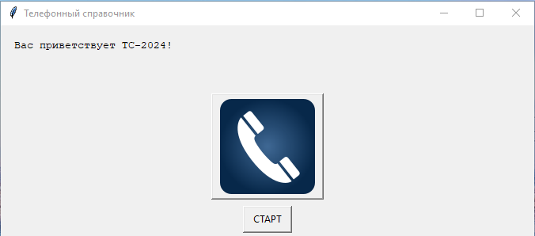
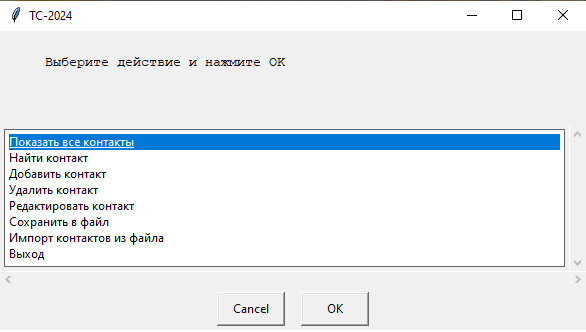
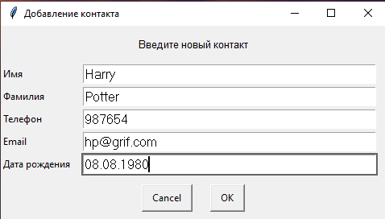
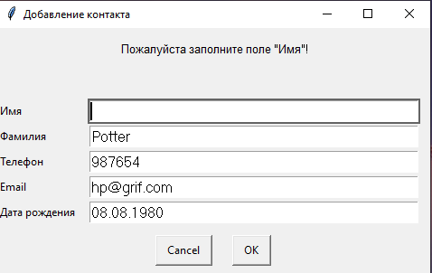
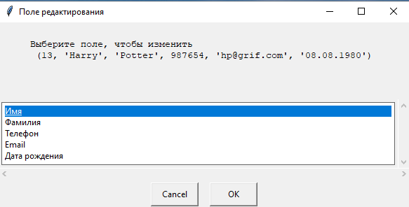
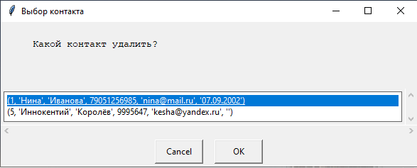
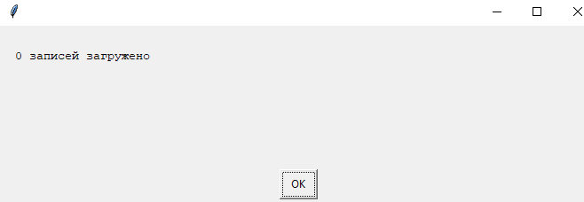
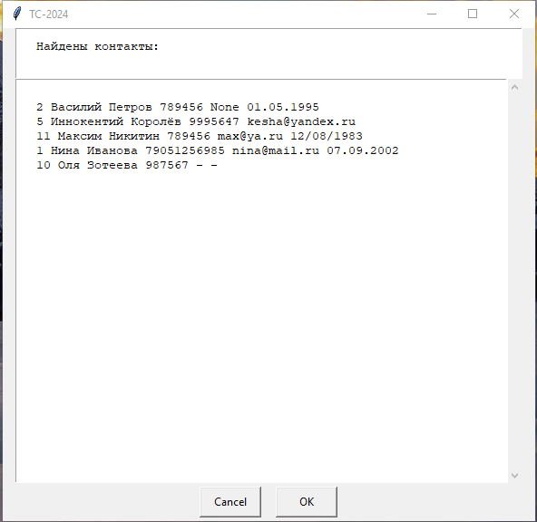
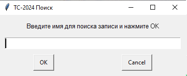
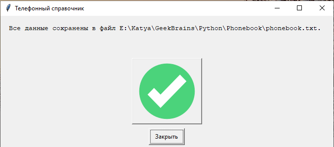

# ТЕЛЕФОННЫЙ СПРАВОЧНИК
### Автор: Вахромеева Екатерина

## Возможности:
* Вывод всех контактов на экран
* Поиск контакта по имени (с частичным сопадением и без учета регистра)
* Редактирование любого поля контакта
* Удаление контакта
* Добавление контакта
* Сохранение в *.txt файл
* Импорт всех записей из *.txt файла
* Все операции происходят в БД **sqlite3**
* Окна взаимодействия реализованы с помощью  **EasyGUI**

## Описание файлов и функций

1. **main.py** - запускается главное меню функцией start_menu;

2. **add.py** - добавление записи функцией add_contact (*пустые поля заменяются на -*), 

* реализована проверка заполнения обязательных полей (имя и телефон)

3. **change_contact.py** - изменение любого поля найденного контакта функцией change_contact

4. **delete_contact.py** - удаление найденного контакта delete_contact

5. **import_from_file.py** - загрузка данных из файла phonebook.txt в БД import_file_to_db (отражает сколько записей загружено, осуществлена проверка на несовпадение уникальных индексов записей)

6. **print_all.py** - функция print_all выводит в окошко все записи из БД, 

* функция find_contact выводит на экран результат поиска по имени (частичное совпадение в любом регистре)

7. **save.py** сохраняет в выбранный файл (подразумевается txt) функцией save_to_file

